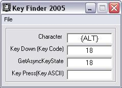



## Key Finder \(Key ASCII,Key Down,GetAsyncKeyState\)

### Description

This is a very basic but handy program that tells you the key down, key ascii, and getasynckeystate values for a key you press.

enjoi!

-LCSBSSRHXXX
 
### More Info
 

             |
---                |---
**Submitted On**   |2004-05-30 12:04:06
**By**             |[LCSBSSRHXXX](https://github.com/Planet-Source-Code/PSCIndex/blob/master/ByAuthor/lcsbssrhxxx.md)
**Level**          |Beginner
**User Rating**    |5.0 (15 globes from 3 users)
**Compatibility**  |VB 6\.0
**Category**       |[Miscellaneous](https://github.com/Planet-Source-Code/PSCIndex/blob/master/ByCategory/miscellaneous__1-1.md)
**World**          |[Visual Basic](https://github.com/Planet-Source-Code/PSCIndex/blob/master/ByWorld/visual-basic.md)
**Archive File**   |[Key\_Finder175248612004\.zip](https://github.com/Planet-Source-Code/lcsbssrhxxx-key-finder-key-ascii-key-down-getasynckeystate__1-54130/archive/master.zip)

